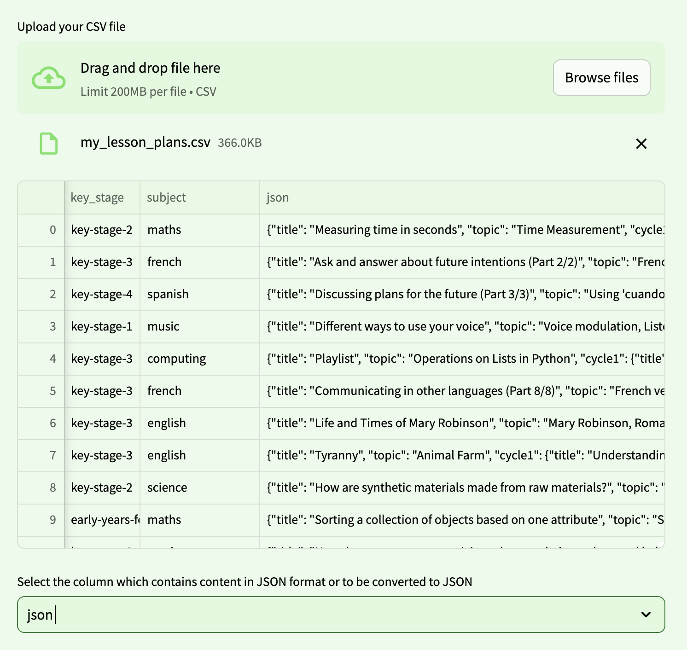

# AutoEval User Documentation: Upload Content

This page allows you to upload data into the lesson_plans table. You can upload a CSV file with a column containing your lesson plans or other educational material.

### 1. Preparing Your CSV File

Ensure your CSV file adheres to the following format:
- **Columns**: Include a column containing your lesson plans data, in either JSON or plain text format.
- **JSON Data**: If the data is in JSON format, ensure it is correctly formatted.
- **Plain Text Data**: If the data is plain text, it will be converted to JSON format with the text stored under the key `text`.

### 2. Uploading Your CSV File

1. **Upload CSV File**: Go to the "Upload your CSV file" section.
2. **Select Your File**: Choose the CSV file from your local machine, or 'drag and drop' the CSV file onto the file loader.

### 3. Viewing and Selecting Data

Once the file is uploaded, the data will be displayed in a table. You can then:
1. **View the Data**: Inspect the uploaded data to ensure it is correct.
2. **Select the Column for Conversion**: Choose the column that contains JSON data or plain text that needs to be converted to JSON format.



### 4. Entering Generation Details

Provide a unique identifier or description for your dataset. This helps differentiate your data from other entries in the lesson plans table when creating a dataset.

### 5. Inserting Data into the Database

After selecting the column and entering the generation details:
1. **Assign Unique IDs**: Each entry will be assigned a unique ID.
2. **Insert Data**: Click on the "Insert Data into Database" button to insert the processed data into the lesson plans table.
3. **Confirmation**: A success message will appear once the data is successfully inserted.

## Detailed Instructions

### Example Data

**JSON Data Example**:
```json
{
  "name": "Lesson 1",
  "content": "This is a lesson plan."
}
```

**String Data Example**:
```text
This is a plain text lesson plan.
```

After conversion, the plain text will be stored as:
```json
{
  "text": "This is a plain text lesson plan."
}
```

### How Your Data Will Be Processed

1. **Upload the CSV File**: Use the file uploader to select your CSV file.
2. **Select the Column**: Choose the column with JSON data or data to be converted to JSON.
3. **Generation Details**: Enter a unique identifier or description for your dataset.
4. **Insert into Database**: Data will be inserted into the lesson plans table with each entry having a unique ID and the provided generation details.

### Handling Missing Values

Rows with missing (NaN) values in the selected column will be skipped during the conversion process to ensure data integrity.

### Manual Data Insertion

Alternatively, you can manually insert data into the lesson plans table using SQL.

## Troubleshooting

### Common Issues

- **Incorrect File Format**: Ensure your CSV file follows the specified format.
- **Invalid JSON Data**: Check that JSON data is correctly formatted.
- **Missing Generation Details**: Provide a unique identifier or description for your dataset.
